# omniroute — Dokumentace kódové základny

🌐 **Jazyky:** 🇺🇸 [angličtina](CODEBASE_DOCUMENTATION.md) | 🇧🇷 [Português (Brazílie)](i18n/pt-BR/CODEBASE_DOCUMENTATION.md) | 🇪🇸 [Español](i18n/es/CODEBASE_DOCUMENTATION.md) | 🇫🇷 [Français](i18n/fr/CODEBASE_DOCUMENTATION.md) | 🇮🇹 [Italiano](i18n/it/CODEBASE_DOCUMENTATION.md) | 🇷🇺 [Русский](i18n/ru/CODEBASE_DOCUMENTATION.md) | 🇨🇳[中文 (简体)](i18n/zh-CN/CODEBASE_DOCUMENTATION.md) | 🇩🇪 [Deutsch](i18n/de/CODEBASE_DOCUMENTATION.md) | 🇮🇳 [हिन्दी](i18n/in/CODEBASE_DOCUMENTATION.md) | 🇹🇭 [ไทย](i18n/th/CODEBASE_DOCUMENTATION.md) | 🇺🇦 [Українська](i18n/uk-UA/CODEBASE_DOCUMENTATION.md) | 🇸🇦 [العربية](i18n/ar/CODEBASE_DOCUMENTATION.md) | 🇯🇵[日本語](i18n/ja/CODEBASE_DOCUMENTATION.md)| 🇻🇳 [Tiếng Việt](i18n/vi/CODEBASE_DOCUMENTATION.md) | 🇧🇬 [Български](i18n/bg/CODEBASE_DOCUMENTATION.md) | 🇩🇰 [Dánsko](i18n/da/CODEBASE_DOCUMENTATION.md) | 🇫🇮 [Suomi](i18n/fi/CODEBASE_DOCUMENTATION.md) | 🇮🇱 [עברית](i18n/he/CODEBASE_DOCUMENTATION.md) | 🇭🇺 [maďarština](i18n/hu/CODEBASE_DOCUMENTATION.md) | 🇮🇩 [Bahasa Indonésie](i18n/id/CODEBASE_DOCUMENTATION.md) | 🇰🇷 [한국어](i18n/ko/CODEBASE_DOCUMENTATION.md) | 🇲🇾 [Bahasa Melayu](i18n/ms/CODEBASE_DOCUMENTATION.md) | 🇳🇱 [Nizozemsko](i18n/nl/CODEBASE_DOCUMENTATION.md) | 🇳🇴 [Norsk](i18n/no/CODEBASE_DOCUMENTATION.md) | 🇵🇹 [Português (Portugalsko)](i18n/pt/CODEBASE_DOCUMENTATION.md) | 🇷🇴 [Română](i18n/ro/CODEBASE_DOCUMENTATION.md) | 🇵🇱 [Polski](i18n/pl/CODEBASE_DOCUMENTATION.md) | 🇸🇰 [Slovenčina](i18n/sk/CODEBASE_DOCUMENTATION.md) | 🇸🇪 [Svenska](i18n/sv/CODEBASE_DOCUMENTATION.md) | 🇵🇭 [Filipínec](i18n/phi/CODEBASE_DOCUMENTATION.md) | 🇨🇿 [Čeština](i18n/cs/CODEBASE_DOCUMENTATION.md)

> Komplexní průvodce pro začátečníky s využitím multiproviderového proxy routeru s umělou inteligencí **od OmniRoute** .

---

## 1. Co je to omniroute?

Omniroute je **proxy router** , který se nachází mezi klienty umělé inteligence (Claude CLI, Codex, Cursor IDE atd.) a poskytovateli umělé inteligence (Anthropic, Google, OpenAI, AWS, GitHub atd.). Řeší jeden velký problém:

> **Různí klienti AI hovoří různými „jazyky“ (formáty API) a různí poskytovatelé AI také očekávají různé „jazyky“.** Omniroute mezi nimi automaticky překládá.

Představte si to jako univerzálního překladatele v Organizaci spojených národů – kterýkoli delegát může mluvit jakýmkoli jazykem a překladatel ho pro kteréhokoli jiného delegáta převede.

---

## 2. Přehled architektury

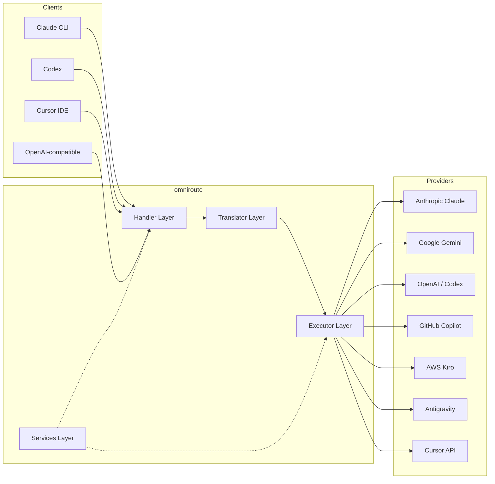

### Základní princip: Překlad typu „hub-and-spoke“

Veškerý překlad formátů prochází **formátem OpenAI jako centrem** :

```
Client Format → [OpenAI Hub] → Provider Format    (request)
Provider Format → [OpenAI Hub] → Client Format    (response)
```

To znamená, že potřebujete pouze **N překladačů** (jeden na formát) místo **N²** (každý pár).

---

## 3. Struktura projektu

```
omniroute/
├── open-sse/                  ← Core proxy library (portable, framework-agnostic)
│   ├── index.js               ← Main entry point, exports everything
│   ├── config/                ← Configuration & constants
│   ├── executors/             ← Provider-specific request execution
│   ├── handlers/              ← Request handling orchestration
│   ├── services/              ← Business logic (auth, models, fallback, usage)
│   ├── translator/            ← Format translation engine
│   │   ├── request/           ← Request translators (8 files)
│   │   ├── response/          ← Response translators (7 files)
│   │   └── helpers/           ← Shared translation utilities (6 files)
│   └── utils/                 ← Utility functions
├── src/                       ← Application layer (Express/Worker runtime)
│   ├── app/                   ← Web UI, API routes, middleware
│   ├── lib/                   ← Database, auth, and shared library code
│   ├── mitm/                  ← Man-in-the-middle proxy utilities
│   ├── models/                ← Database models
│   ├── shared/                ← Shared utilities (wrappers around open-sse)
│   ├── sse/                   ← SSE endpoint handlers
│   └── store/                 ← State management
├── data/                      ← Runtime data (credentials, logs)
│   └── provider-credentials.json   (external credentials override, gitignored)
└── tester/                    ← Test utilities
```

---

## 4. Rozdělení podle modulů

### 4.1 Konfigurace ( `open-sse/config/` )

Jediný **zdroj pravdivých informací** pro všechny konfigurace poskytovatelů.

Soubor | Účel
--- | ---
`constants.ts` | Objekt `PROVIDERS` se základními URL adresami, přihlašovacími údaji OAuth (výchozí), záhlavími a výchozími systémovými výzvami pro každého poskytovatele. Definuje také `HTTP_STATUS` , `ERROR_TYPES` , `COOLDOWN_MS` , `BACKOFF_CONFIG` a `SKIP_PATTERNS` .
`credentialLoader.ts` | Načte externí přihlašovací údaje z `data/provider-credentials.json` a sloučí je s pevně zakódovanými výchozími hodnotami v `PROVIDERS` . Uchovává tajné údaje mimo kontrolu zdrojového kódu a zároveň zachovává zpětnou kompatibilitu.
`providerModels.ts` | Centrální registr modelů: mapuje aliasy poskytovatelů → ID modelů. Funkce jako `getModels()` , `getProviderByAlias()` .
`codexInstructions.ts` | Systémové instrukce vložené do požadavků Codexu (omezení úprav, pravidla sandboxu, zásady schvalování).
`defaultThinkingSignature.ts` | Výchozí „myšlenkové“ podpisy pro modely Claude a Gemini.
`ollamaModels.ts` | Definice schématu pro lokální Ollama modely (název, velikost, rodina, kvantizace).

#### Postup načítání přihlašovacích údajů

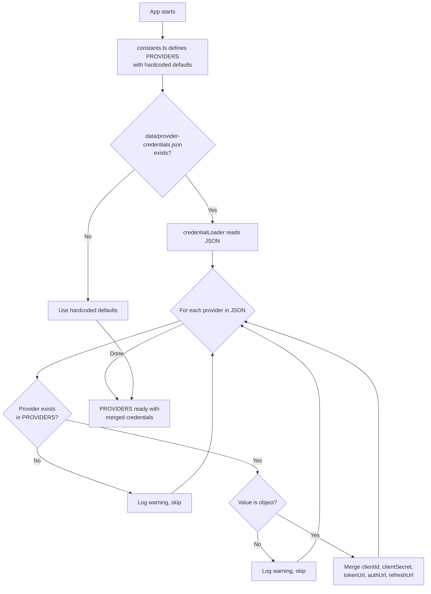

---

### 4.2 Vykonavatelé ( `open-sse/executors/` )

Prováděcí metody zapouzdřují **logiku specifickou pro poskytovatele** pomocí **vzoru strategie** . Každý prováděcí metody podle potřeby přepisují základní metody.

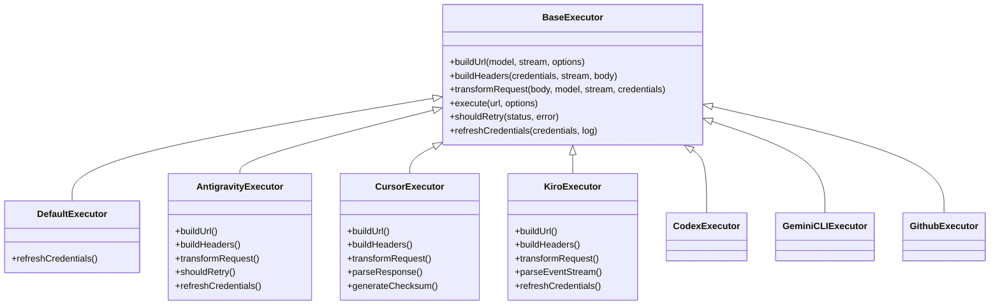

Vykonavatel | Poskytovatel | Klíčové specializace
--- | --- | ---
`base.ts` | — | Abstraktní základ: tvorba URL adres, hlavičky, logika opakování, aktualizace přihlašovacích údajů
`default.ts` | Claude, Gemini, OpenAI, GLM, Kimi, MiniMax | Aktualizace generického tokenu OAuth pro standardní poskytovatele
`antigravity.ts` | Kód Google Cloud | Generování ID projektu/relace, záložní více URL adres, vlastní analýza opakovaných pokusů z chybových zpráv („reset po 2h7m23s“)
`cursor.ts` | IDE kurzoru | **Nejsložitější** : autorizace kontrolního součtu SHA-256, kódování požadavků Protobuf, analýza binárních EventStream → SSE odpovědí
`codex.ts` | OpenAI Codex | Vkládá systémové instrukce, spravuje úrovně myšlení, odstraňuje nepodporované parametry
`gemini-cli.ts` | Google Gemini CLI | Vytvoření vlastní URL adresy ( `streamGenerateContent` ), aktualizace tokenu Google OAuth
`github.ts` | GitHub Copilot | Systém duálních tokenů (GitHub OAuth + Copilot token), napodobování hlaviček VSCode
`kiro.ts` | AWS CodeWhisperer | Binární parsování AWS EventStream, rámce událostí AMZN, odhad tokenů
`index.ts` | — | Továrna: název poskytovatele map → třída exekutoru s výchozím záložním nastavením

---

### 4.3 Obslužné rutiny ( `open-sse/handlers/` )

**Orchestrační vrstva** – koordinuje překlad, provádění, streamování a zpracování chyb.

Soubor | Účel
--- | ---
`chatCore.ts` | **Centrální orchestrátor** (~600 řádků). Zvládá kompletní životní cyklus požadavku: detekce formátu → překlad → odeslání exekutoru → streamovaná/nestreamovaná odpověď → aktualizace tokenu → zpracování chyb → protokolování využití.
`responsesHandler.ts` | Adaptér pro OpenAI Responses API: převádí formát odpovědí → Dokončení chatu → odesílá do `chatCore` → převádí SSE zpět do formátu odpovědí.
`embeddings.ts` | Obslužná rutina generování embeddingu: řeší model embeddingu → poskytovatele, odesílá do API poskytovatele, vrací odpověď na embedding kompatibilní s OpenAI. Podporuje 6+ poskytovatelů.
`imageGeneration.ts` | Obslužná rutina generování obrázků: řeší model obrázku → poskytovatele, podporuje režimy kompatibilní s OpenAI, Gemini-image (Antigravity) a fallback (Nebius). Vrací obrázky v base64 nebo URL.

#### Životní cyklus požadavku (chatCore.ts)

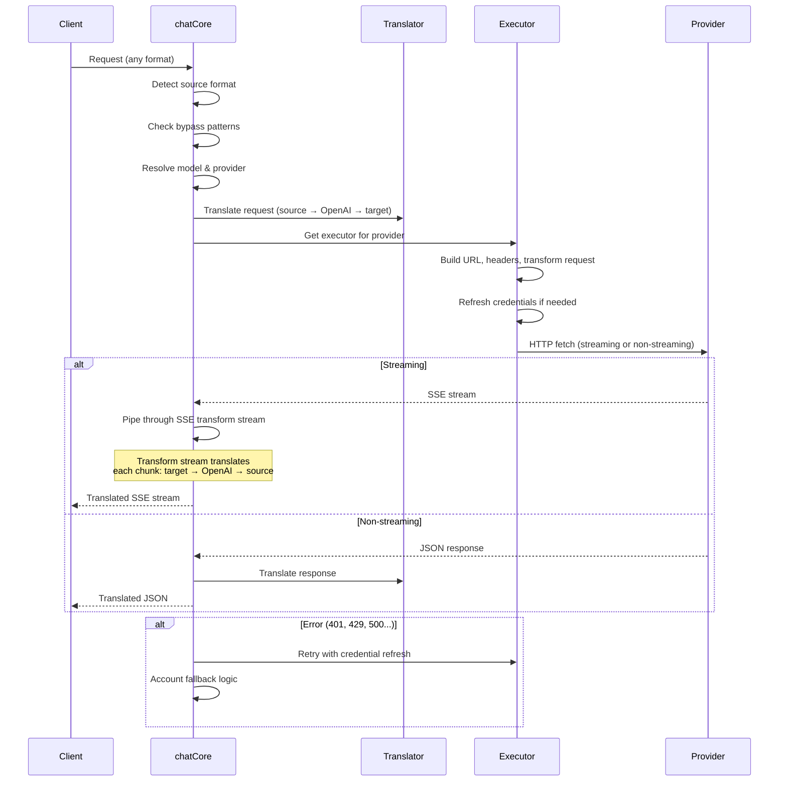

---

### 4.4 Služby ( `open-sse/services/` )

Obchodní logika, která podporuje obslužné rutiny a vykonavatele.

Soubor | Účel
--- | ---
`provider.ts` | **Detekce formátu** ( `detectFormat` ): analyzuje strukturu těla požadavku a identifikuje formáty Claude/OpenAI/Gemini/Antigravity/Responses (včetně heuristiky `max_tokens` pro Claude). Dále: tvorba URL, tvorba hlaviček, normalizace konfigurace thinking. Podporuje dynamické poskytovatele kompatibilní `openai-compatible-*` a `anthropic-compatible-*` .
`model.ts` | Analýza řetězců modelu ( `claude/model-name` → `{provider: "claude", model: "model-name"}` ), rozlišení aliasů s detekcí kolizí, sanitizace vstupu (odmítá průchod cestou/řídicí znaky) a rozlišení informací o modelu s podporou asynchronních metod pro získávání aliasů.
`accountFallback.ts` | Ovládání limitů rychlosti: exponenciální upomínka (1 s → 2 s → 4 s → max. 2 min), správa doby zpoždění účtu, klasifikace chyb (které chyby spouštějí fallback a které ne).
`tokenRefresh.ts` | Aktualizace tokenu OAuth pro **všechny poskytovatele** : Google (Gemini, Antigravity), Claude, Codex, Qwen, iFlow, GitHub (duální token OAuth + Copilot), Kiro (AWS SSO OIDC + sociální ověřování). Zahrnuje mezipaměť deduplikace promise za provozu a opakování s exponenciálním zpožděním.
`combo.ts` | **Kombinované modely** : řetězce záložních modelů. Pokud model A selže s chybou způsobilou pro záložní model, zkuste model B, poté C atd. Vrací skutečné stavové kódy upstreamu.
`usage.ts` | Načítá data o kvótách/využití z API poskytovatelů (kvóty GitHub Copilot, kvóty modelu Antigravity, limity rychlosti Codexu, rozpisy využití Kiro, nastavení Claude).
`accountSelector.ts` | Inteligentní výběr účtu s algoritmem bodování: pro výběr optimálního účtu pro každý požadavek se zohledňuje priorita, zdravotní stav, pozice v systému round robin a stav ochlazování.
`contextManager.ts` | Správa životního cyklu kontextu požadavku: vytváří a sleduje objekty kontextu pro každý požadavek s metadaty (ID požadavku, časová razítka, informace o poskytovateli) pro ladění a protokolování.
`ipFilter.ts` | Řízení přístupu založené na IP adrese: podporuje režimy povolených seznamů a blokovaných seznamů. Před zpracováním požadavků API ověřuje IP adresu klienta podle nakonfigurovaných pravidel.
`sessionManager.ts` | Sledování relací s otisky prstů klientů: sleduje aktivní relace pomocí hašovaných identifikátorů klientů, monitoruje počty požadavků a poskytuje metriky relací.
`signatureCache.ts` | Mezipaměť deduplikace na základě signatur požadavků: zabraňuje duplicitním požadavkům ukládáním nedávných signatur požadavků do mezipaměti a vrácením odpovědí z mezipaměti pro identické požadavky v rámci časového okna.
`systemPrompt.ts` | Globální vložení systémového výzvy: přidá konfigurovatelnou systémovou výzvu ke všem požadavkům s možností kompatibility pro jednotlivé poskytovatele.
`thinkingBudget.ts` | Správa rozpočtu tokenů uvažování: podporuje režimy průchodu, automatický (konfigurace strip thinking), vlastní (pevný rozpočet) a adaptivní (měřítko složitosti) pro řízení tokenů myšlení/uvažování.
`wildcardRouter.ts` | Směrování podle vzorů zástupných znaků: rozpoznává vzory zástupných znaků (např. `*/claude-*` ) na konkrétní páry poskytovatel/model na základě dostupnosti a priority.

#### Deduplikace obnovení tokenů

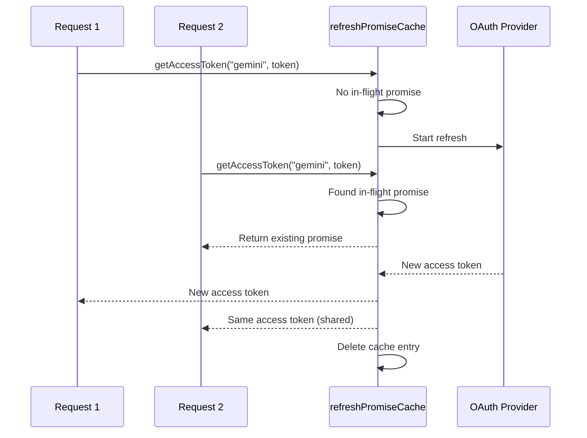

#### Záložní stavový automat účtu

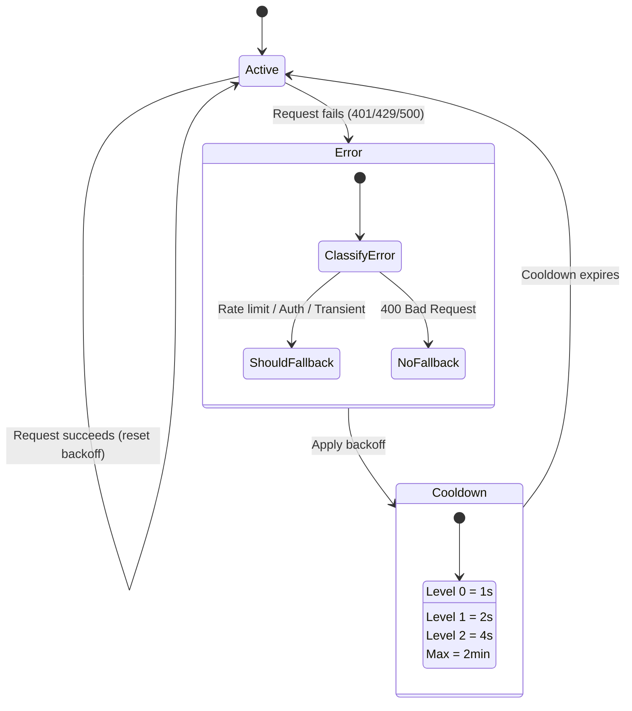

#### Řetězec kombinovaných modelů

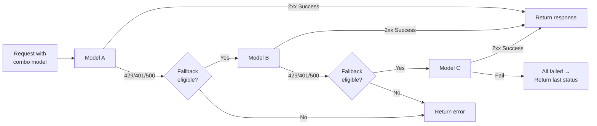

---

### 4.5 Překladač ( `open-sse/translator/` )

**Modul pro překlad formátů** využívající systém samoregistrujících se pluginů.

#### Architektura

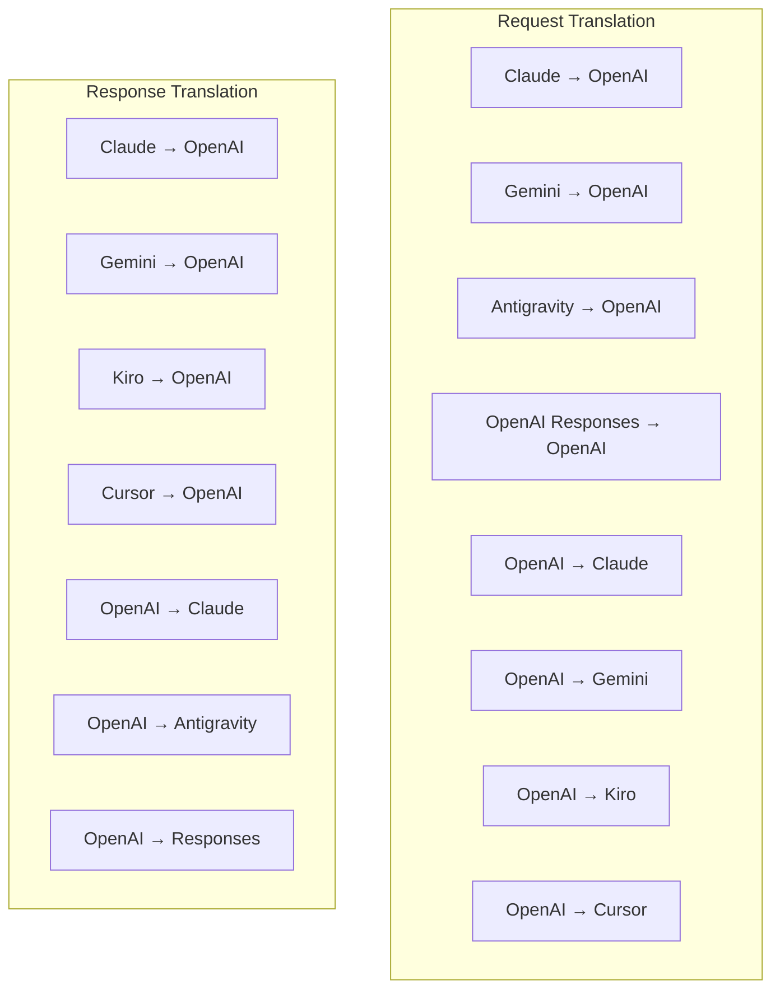

Adresář | Soubory | Popis
--- | --- | ---
`request/` | 8 překladatelů | Převod těl požadavků mezi formáty. Každý soubor se při importu sám zaregistruje pomocí `register(from, to, fn)` .
`response/` | 7 překladatelů | Převádí bloky odpovědí streamovaných dat mezi formáty. Zpracovává typy událostí SSE, myšlenkové bloky a volání nástrojů.
`helpers/` | 6 pomocníků | Sdílené utility: `claudeHelper` (extrakce systémových prompts, thinking config), `geminiHelper` (mapování částí/obsahu), `openaiHelper` (filtrování formátů), `toolCallHelper` (generování ID, vkládání chybějících odpovědí), `maxTokensHelper` , `responsesApiHelper` .
`index.ts` | — | Překladový engine: `translateRequest()` , `translateResponse()` , správa stavu, registr.
`formats.ts` | — | Formátovací konstanty: `OPENAI` , `CLAUDE` , `GEMINI` , `ANTIGRAVITY` , `KIRO` , `CURSOR` , `OPENAI_RESPONSES` .

#### Klíčový design: Samoregistrující se pluginy

```javascript
// Each translator file calls register() on import:
import { register } from "../index.js";
register("claude", "openai", translateClaudeToOpenAI);

// The index.js imports all translator files, triggering registration:
import "./request/claude-to-openai.js"; // ← self-registers
```

---

### 4.6 Nástroje ( `open-sse/utils/` )

Soubor | Účel
--- | ---
`error.ts` | Vytváření chybové odezvy (formát kompatibilní s OpenAI), parsování chyb v upstreamu, extrakce doby opakování Antigravity z chybových zpráv, streamování chyb SSE.
`stream.ts` | **SSE Transform Stream** — základní streamovací kanál. Dva režimy: `TRANSLATE` (plný překlad formátu) a `PASSTHROUGH` (normalizace + extrakce využití). Zpracovává ukládání bloků do vyrovnávací paměti, odhad využití a sledování délky obsahu. Instance kodéru/dekodéru pro každý stream se vyhýbají sdílenému stavu.
`streamHelpers.ts` | Nízkoúrovňové utility SSE: `parseSSELine` (tolerantní k bílým znakům), `hasValuableContent` (filtruje prázdné segmenty pro OpenAI/Claude/Gemini), `fixInvalidId` , `formatSSE` (serializace SSE s ohledem na formát s čištěním `perf_metrics` ).
`usageTracking.ts` | Extrakce využití tokenů z libovolného formátu (Claude/OpenAI/Gemini/Responses), odhad s oddělenými poměry znaků na token pro jednotlivé nástroje/zprávy, přidání vyrovnávací paměti (bezpečnostní rezerva 2000 tokenů), filtrování polí specifických pro formát, protokolování konzole s barvami ANSI.
`requestLogger.ts` | Protokolování požadavků na základě souborů (přihlášení pomocí `ENABLE_REQUEST_LOGS=true` ). Vytváří složky relací s očíslovanými soubory: `1_req_client.json` → `7_res_client.txt` . Veškeré I/O operace jsou asynchronní (aktivní a zapomenutý). Maskuje citlivé hlavičky.
`bypassHandler.ts` | Zachycuje specifické vzory z Claude CLI (extrakce názvu, zahřívání, počet) a vrací falešné odpovědi bez volání jakéhokoli poskytovatele. Podporuje streamování i nestreamování. Záměrně omezeno na rozsah Claude CLI.
`networkProxy.ts` | Rozpozná URL odchozí proxy pro daného poskytovatele s prioritou: konfigurace specifická pro poskytovatele → globální konfigurace → proměnné prostředí ( `HTTPS_PROXY` / `HTTP_PROXY` / `ALL_PROXY` ). Podporuje výjimky `NO_PROXY` . Ukládá konfiguraci do mezipaměti po dobu 30 sekund.

#### Streamovací kanál SSE

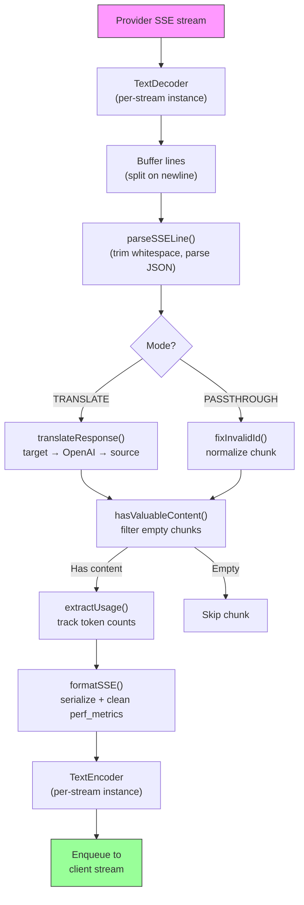

#### Struktura relace protokolování požadavků

```
logs/
└── claude_gemini_claude-sonnet_20260208_143045/
    ├── 1_req_client.json      ← Raw client request
    ├── 2_req_source.json      ← After initial conversion
    ├── 3_req_openai.json      ← OpenAI intermediate format
    ├── 4_req_target.json      ← Final target format
    ├── 5_res_provider.txt     ← Provider SSE chunks (streaming)
    ├── 5_res_provider.json    ← Provider response (non-streaming)
    ├── 6_res_openai.txt       ← OpenAI intermediate chunks
    ├── 7_res_client.txt       ← Client-facing SSE chunks
    └── 6_error.json           ← Error details (if any)
```

---

### 4.7 Aplikační vrstva ( `src/` )

Adresář | Účel
--- | ---
`src/app/` | Webové uživatelské rozhraní, trasy API, middleware Express, obslužné rutiny zpětných volání OAuth
`src/lib/` | Přístup k databázi ( `localDb.ts` , `usageDb.ts` ), ověřování, sdílení
`src/mitm/` | Nástroje proxy typu „man-in-the-middle“ pro zachycení provozu poskytovatelů
`src/models/` | Definice modelů databáze
`src/shared/` | Obálky kolem funkcí open-sse (provider, stream, error atd.)
`src/sse/` | Obslužné rutiny koncových bodů SSE, které propojují knihovnu open-sse s trasami Express
`src/store/` | Správa stavu aplikací

#### Významné trasy API

Trasa | Metody | Účel
--- | --- | ---
`/api/provider-models` | GET/POST/DELETE | CRUD pro vlastní modely na poskytovatele
`/api/models/catalog` | GET | Agregovaný katalog všech modelů (chat, embedding, image, custom) seskupených podle poskytovatele
`/api/settings/proxy` | GET/PUT/DELETE | Konfigurace hierarchické odchozí proxy ( `global/providers/combos/keys` )
`/api/settings/proxy/test` | POST | Ověřuje připojení proxy a vrací veřejnou IP adresu/latenci
`/v1/providers/[provider]/chat/completions` | POST | Vyhrazené dokončování chatu pro jednotlivé poskytovatele s ověřováním modelu
`/v1/providers/[provider]/embeddings` | POST | Vyhrazené vkládání pro jednotlivé poskytovatele s ověřováním modelu
`/v1/providers/[provider]/images/generations` | POST | Vyhrazené generování obrázků pro každého poskytovatele s ověřováním modelu
`/api/settings/ip-filter` | GET/PUT | Správa povolených/blokovaných IP adres
`/api/settings/thinking-budget` | GET/PUT | Konfigurace rozpočtu tokenů zdůvodnění (průchozí/automatická/vlastní/adaptivní)
`/api/settings/system-prompt` | GET/PUT | Globální vložení systémového promptu pro všechny požadavky
`/api/sessions` | GET | Sledování a metriky aktivních relací
`/api/rate-limits` | GET | Stav limitu sazby na účet

---

## 5. Klíčové návrhové vzory

### 5.1 Překlad typu Hub-and-Spoke

Všechny formáty se překládají prostřednictvím **formátu OpenAI jako ústředny** . Přidání nového poskytovatele vyžaduje napsání pouze **jednoho páru** překladačů (do/z OpenAI), nikoli N párů.

### 5.2 Vzor strategie exekutora

Každý poskytovatel má vyhrazenou třídu exekutoru, která dědí z `BaseExecutor` . Továrna v `executors/index.ts` vybere ten správný za běhu.

### 5.3 Systém samoregistračních pluginů

Moduly překladače se při importu registrují pomocí `register()` . Přidání nového překladače znamená pouze vytvoření souboru a jeho import.

### 5.4 Záložní účet s exponenciálním oddlužením

Když poskytovatel vrátí 429/401/500, systém může přepnout na další účet s exponenciálním zpožděním (1s → 2s → 4s → max. 2min).

### 5.5 Kombinované modelové řetězy

„Kombinace“ seskupuje více řetězců `provider/model` . Pokud první selže, automaticky se vrátí k dalšímu.

### 5.6 Stavový streamovací překlad

Překlad odpovědí udržuje stav napříč bloky SSE (sledování myšlenkových bloků, akumulace volání nástrojů, indexování bloků obsahu) prostřednictvím mechanismu `initState()` .

### 5.7 Bezpečnostní vyrovnávací paměť pro použití

K hlášenému využití je přidána vyrovnávací paměť o kapacitě 2000 tokenů, aby se zabránilo tomu, že klienti dosáhnou limitů kontextového okna v důsledku režijních nákladů systémových výzev a překladu formátu.

---

## 6. Podporované formáty

Formát                    | Směr        | Identifikátor      |
| ----------------------- | ----------- | ------------------ |
| OpenAI Chat Completions | zdroj + cíl | `openai`           |
| OpenAI Responses API    | zdroj + cíl | `openai-responses` |
| Anthropic Claude        | zdroj + cíl | `claude`           |
| Google Gemini           | zdroj + cíl | `gemini`           |
| Google Gemini CLI       | jen cíl     | `gemini-cli`       |
| Antigravity             | zdroj + cíl | `antigravity`      |
| AWS Kiro                | jen cíl     | `kiro`             |
| Cursor                  | jen cíl     | `cursor`           |

---

## 7. Podporovaní poskytovatelé

| Poskytovatel             | Metoda ověřování         | Vykonavatel | Klíčové poznámky                             |
| ------------------------ | ------------------------ | ----------- | -------------------------------------------- |
| Anthropic Claude         | API klíč nebo OAuth      | Výchozí     | Používá hlavičku `x-api-key`                 |
| Google Gemini            | API klíč nebo OAuth      | Výchozí     | Používá hlavičku `x-goog-api-key`            |
| Google Gemini CLI        | OAuth                    | GeminiCLI   | Používá koncový bod `streamGenerateContent`  |
| Antigravity              | OAuth                    | Antigravity | Záložní více URL, analýza opakovaných pokusů |
| OpenAI                   | API klíč                 | Výchozí     | Autorizace standardního nosiče               |
| Codex                    | OAuth                    | Codex       | Vkládá systémové instrukce, řídí myšlení     |
| GitHub Copilot           | OAuth + Copilot token    | Github      | Duální token, napodobování záhlaví VSCode    |
| Kiro (AWS)               | AWS SSO OIDC nebo Social | Kiro        | Analýza binárního EventStreamu               |
| Cursor IDE               | Checksum auth            | Cursor      | Kódování Protobuf, kontrolní součty SHA-256  |
| Qwen                     | OAuth                    | Výchozí     | Standardní ověřování                         |
| iFlow                    | OAuth (Basic + Bearer)   | Výchozí     | Duální hlavička pro autorizaci               |
| OpenRouter               | API klíč                 | Výchozí     | Autorizace standardního nosiče               |
| GLM, Kimi, MiniMax       | API klíč                 | Výchozí     | Kompatibilní s Claude, použijte `x-api-key`  |
| `openai-compatible-*`    | API klíč                 | Výchozí     | Dynamické: jakýkoli OpenAI kompatibilní      |
| `anthropic-compatible-*` | API klíč                 | Výchozí     | Dynamické: jakýkoli Claude kompatibilní      |

---

## 8. Souhrn datového toku

### Žádost o streamování

```mermaid
flowchart LR
    A["Client"] --> B["detectFormat()"]
    B --> C["translateRequest()\nsource → OpenAI → target"]
    C --> D["Executor\nbuildUrl + buildHeaders"]
    D --> E["fetch(providerURL)"]
    E --> F["createSSEStream()\nTRANSLATE mode"]
    F --> G["parseSSELine()"]
    G --> H["translateResponse()\ntarget → OpenAI → source"]
    H --> I["extractUsage()\n+ addBuffer"]
    I --> J["formatSSE()"]
    J --> K["Client receives\ntranslated SSE"]
    K --> L["logUsage()\nsaveRequestUsage()"]
```

### Žádost o nestreamování

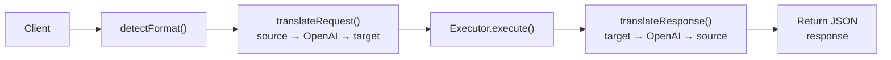

### Obtokový tok (Claude CLI)

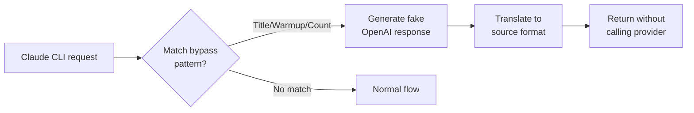
